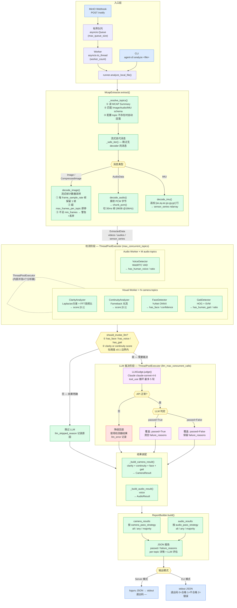

# Data Quality Agent

[](https://github.com/jacexh/data-quality-agent/actions/workflows/test.yml)

机器人传感器数据（MCAP 文件）自动质量评估系统。

MinIO 存储桶上传触发 webhook → 有界队列 + 多 worker 并发下载 → 帧采样提取 → 并发算法检测 → LLM 裁决（按需）→ JSON 质量报告。

支持两种运行模式：**Server 模式**（FastAPI + MinIO webhook）和 **CLI 模式**（本地文件直接分析）。

## 功能概览

- **图像清晰度检测**：Laplacian + Tenengrad 方差，量化视频帧的焦距质量
- **运动连续性检测**：Farneback 光流，检测帧间抖动或跳帧
- **人脸检测**：YuNet ONNX 模型，识别画面中是否存在人脸（隐私合规）
- **人声检测**：WebRTC VAD，检测录音中是否含有人类语音
- **步态检测**：HOG 描述符，检测画面中是否存在人形步态
- **LLM 裁决**：分数接近阈值或敏感信息被标记时，调用 Claude 进行二次审核，支持关键帧图像查阅和 IMU 数据分析

## 系统架构

```
agent/
├── main.py          # FastAPI：POST /notify（webhook）, GET /health
├── cli.py           # CLI 入口：agent-cli analyze <file.mcap>
├── runner.py        # 共享分析逻辑：analyze_local_file()，Server 和 CLI 共用；
│                    # 检测阶段用 ThreadPoolExecutor（OpenCV 释放 GIL，无需跨进程 IPC）
├── config.py        # Pydantic Settings，从 .env 读取
├── extractor.py     # McapExtractor：.mcap → ExtractedData；流式帧采样（循环内计数器，
│                    # 达到 max_frames_per_topic 立即停止 decode，避免全量帧驻留内存）
├── pipeline.py      # AnalysisPipeline：ThreadPoolExecutor 并发运行检测器；
│                    # _resize_frames() 在分析前将帧缩至 max_analysis_dim，原始帧保留给 LLM
├── llm_judge.py     # LLMJudge：Claude tool_use 循环，最多 5 轮
├── report.py        # ReportBuilder：合并结果 → JSON 报告
└── analyzers/
    ├── base.py      # Analyzer Protocol + TypedDicts（ExtractedData, Results）
    ├── clarity.py   # 图像清晰度（Laplacian + FFT）
    ├── continuity.py# 运动连续性（Farneback 光流）
    ├── face.py      # 人脸检测（YuNet ONNX）
    ├── voice.py     # 人声检测（WebRTC VAD）
    └── gait.py      # 步态检测（HOG + SVM）
```

**完整处理流程：**



## 快速开始

### 前置条件

- Python 3.12+
- [uv](https://github.com/astral-sh/uv) 包管理器
- Docker & Docker Compose（完整栈运行）

### CLI 模式（本地文件分析）

无需启动服务，直接分析本地 `.mcap` 文件：

```bash
# 安装依赖
uv pip install -e ".[dev]"

# 配置环境变量（ANTHROPIC_API_KEY 可选，缺失时跳过 LLM 裁决）
cp .env.example .env

# 分析本地文件，JSON 报告输出到 stdout
agent-cli analyze /path/to/recording.mcap

# 退出码：0 = 质量合格，1 = 不合格或分析错误，2 = 参数错误
echo "Exit: $?"
```

### Server 模式（本地开发）

```bash
# 安装依赖
uv pip install -e ".[dev]"

# 配置环境变量
cp .env.example .env
# 编辑 .env，填写 ANTHROPIC_API_KEY

# 启动服务（port 8000）
uv run uvicorn agent.main:app --reload
```

### Docker 完整栈（推荐）

```bash
# 启动 MinIO + nginx + Agent（单实例）
docker-compose up --build

# 水平扩容（多 Agent 实例，nginx 自动负载均衡）
docker compose up --build --scale agent=4

# 停止
docker-compose down
```

启动后：
- Agent API（经由 nginx）：`http://localhost:8000`
- MinIO 控制台：`http://localhost:9001`（账号 `minioadmin` / `minioadmin`）
- MinIO S3 API：`http://localhost:9000`

上传 `.mcap` 文件到 `robot-uploads` 存储桶即可自动触发质量评估。

> **水平扩容说明：** 每个 Agent 实例持有独立的有界队列和 worker 池，nginx 以轮询方式将请求分发到各实例；若某实例队列已满（返回 429），nginx 自动重试其他实例（`proxy_next_upstream http_429`）。

## 环境变量

复制 `.env.example` 为 `.env` 并按需修改：

| 变量名 | 默认值 | 说明 |
|--------|--------|------|
| `ANTHROPIC_API_KEY` | _(必填)_ | Claude API 密钥 |
| `ANTHROPIC_BASE_URL` | _(空，使用官方地址)_ | Anthropic API 入口地址，可替换为代理或私有部署地址 |
| `MINIO_ENDPOINT` | `minio:9000` | MinIO 服务地址 |
| `MINIO_ACCESS_KEY` | `minioadmin` | MinIO 访问密钥 |
| `MINIO_SECRET_KEY` | `minioadmin` | MinIO 秘密密钥 |
| `MINIO_BUCKET` | `robot-uploads` | 监听的存储桶名称 |
| `MINIO_USE_SSL` | `false` | 是否启用 HTTPS |
| `CLARITY_THRESHOLD` | `0.6` | 清晰度合格分数线（0-1） |
| `CONTINUITY_THRESHOLD` | `0.6` | 连续性合格分数线（0-1） |
| `LLM_REVIEW_MARGIN` | `0.1` | 触发 LLM 二次审核的阈值容差 |
| `MINIMUM_DURATION_SECONDS` | `1.0` | 录制最短时长要求（秒） |
| `WEBHOOK_AUTH_TOKEN` | _(可选)_ | webhook Bearer Token 鉴权 |
| `LLM_MODEL` | `claude-sonnet-4-6` | 使用的 Claude 模型 |
| `LOG_LEVEL` | `INFO` | 日志级别 |
| `MAX_QUEUE_SIZE` | `100` | 每实例有界队列容量，超出返回 429 |
| `WORKER_COUNT` | `4` | 每实例并发 worker 数量 |
| `FRAME_SAMPLE_RATE` | `30` | 视觉检测帧采样率（每 N 帧取 1 帧） |
| `MAX_FRAMES_PER_TOPIC` | `300` | 每个 topic 采样帧数上限，达到后立即停止 decode |
| `MAX_ANALYSIS_DIM` | `640` | 分析用帧的最大边长（像素），超出则等比缩放；原始分辨率帧仍用于 LLM 裁决；`0` = 不限制 |
| `MAX_CONCURRENT_TOPICS` | `4` | 检测阶段并发 topic 数（ThreadPoolExecutor workers） |

## API

### `GET /health`

健康检查。

```json
{"status": "ok"}
```

### `POST /notify`

接收 MinIO S3 事件通知。非 `.mcap` 文件将被忽略，任务入队后异步处理。

**请求体（MinIO 标准格式）：**

```json
{
  "Records": [{
    "s3": {
      "bucket": {"name": "robot-uploads"},
      "object": {"key": "session_001.mcap"}
    }
  }]
}
```

**响应：**

| 状态码 | body | 含义 |
|--------|------|------|
| `200` | `{"status": "accepted"}` | 任务已入队 |
| `200` | `{"status": "ignored"}` | 非 mcap 文件，跳过 |
| `200` | `{"status": "duplicate"}` | 该文件正在处理中，跳过 |
| `429` | `{"status": "queue_full"}` | 队列已满，请稍后重试 |
| `401` | — | Token 鉴权失败 |

## 质量报告

分析完成后，报告以结构化 JSON 输出（Server 模式通过 loguru，CLI 模式输出到 stdout）。

### Schema

```
{
  report_id             string        唯一报告 ID（UUID）
  source_file           string        MCAP 文件路径或对象名
  minio_bucket          string        来源存储桶（CLI 模式为空）
  analyzed_at           string        ISO 8601 UTC 时间戳
  duration_seconds      float | null  录制时长（秒）
  camera_pass_strategy  "all"|"any"|"majority"  相机 topic 整体判定策略
  audio_pass_strategy   "all"|"any"|"majority"  音频 topic 整体判定策略
  cameras               CameraResult[]           逐 topic 相机分析结果
  audios                AudioResult[]            逐 topic 音频分析结果
  overall_passed        bool          整体是否合格
  failure_reasons       string[]      整体不合格原因（如 duration_too_short）
  analyzer_errors       string[]      提取阶段错误
}

CameraResult {
  topic                 string        ROS topic 名称
  frame_count           int           实际分析帧数
  clarity {
    score               float         0–1，越高越清晰
    method              string        "laplacian+fft"
    detail {
      mean_laplacian_variance  float
      fft_high_freq_ratio      float
      frame_score_std          float
      frame_count              int
    }
  }
  continuity {
    score               float         0–1，越高越连续
    method              string        "optical_flow"
    detail {
      mean_flow_magnitude      float
      flow_magnitude_std       float
      flow_direction_std       float
      discontinuity_frames     int
      frame_count              int
    }
  }
  face {
    has_face            bool
    face_count          int
    face_frame_ratio    float
    max_confidence      float
  }
  gait {
    has_human_gait      bool
    person_frame_ratio  float
    max_detection_weight float
  }
  llm_assessment        object | null  LLM 裁决结果（未触发时为 null）
  llm_skipped_reason    string | null  跳过 LLM 的原因
  passed                bool
  failure_reasons       string[]       如 clarity / has_face / has_human_gait
  analyzer_errors       string[]       检测器级别错误
}

AudioResult {
  topic                 string
  audio_frame_count     int
  voice {
    has_human_voice     bool
    speech_frame_ratio  float
  }
  llm_assessment        object | null
  llm_skipped_reason    string | null
  passed                bool
  failure_reasons       string[]       如 has_human_voice
  analyzer_errors       string[]
}
```

`overall_passed: false` 时，可从 `failure_reasons`（整体）和每个 `cameras[i].failure_reasons` / `audios[i].failure_reasons`（per-topic）定位具体原因。

## LLM 裁决逻辑

以下任一条件满足时自动调用 LLM：

- 检测到人脸（`has_face: true`）
- 检测到人类步态（`has_human_gait: true`）
- 检测到人声（跨模态验证）
- 清晰度或连续性分数在阈值 ±0.1（`LLM_REVIEW_MARGIN`）范围内

LLM 可调用两个工具辅助判断：
- `get_key_frames`：获取指定帧的 JPEG 图像（Base64 编码）
- `get_imu_summary`：获取指定时间窗口的 IMU 数据统计

Claude API 异常时自动降级，仅使用检测器结果作为最终判定，不影响报告输出。

### 报告样例

```json
{
  "report_id": "0be1b8d7-39ae-440e-8b17-3edde1551a43",
  "source_file": "data/20241203_demo_Office_PickPlace_ljw_152145.mcap",
  "minio_bucket": "",
  "analyzed_at": "2026-03-22T11:08:51Z",
  "duration_seconds": 364.724,
  "camera_pass_strategy": "all",
  "audio_pass_strategy": "all",
  "cameras": [
    {
      "topic": "/rgbd/color/image_raw/compressed",
      "frame_count": 300,
      "clarity": {
        "score": 0.5171,
        "method": "laplacian+fft",
        "detail": {
          "mean_laplacian_variance": 799.9532,
          "fft_high_freq_ratio": 0.0051,
          "frame_score_std": 0.0022,
          "frame_count": 300
        }
      },
      "continuity": {
        "score": 0.5344,
        "method": "optical_flow",
        "detail": {
          "mean_flow_magnitude": 2.256,
          "flow_magnitude_std": 1.5424,
          "flow_direction_std": 1.1585,
          "discontinuity_frames": 169,
          "frame_count": 300
        }
      },
      "face": {
        "has_face": true,
        "face_count": 2,
        "face_frame_ratio": 0.0067,
        "max_confidence": 0.7684
      },
      "gait": {
        "has_human_gait": true,
        "person_frame_ratio": 0.0082,
        "max_detection_weight": 0.6120
      },
      "llm_assessment": {
        "passed": true,
        "overrode_detector": true,
        "override_detail": "人脸检测和步态检测均为误报：画面内容为密集文本/文档图像，算法误将文字纹理识别为人脸和步态特征。",
        "narrative": "经逐帧审查，所有画面均为文档内容，未检测到真实活体人脸或人体步态，判定通过。",
        "frames_reviewed": [0, 30, 60, 90, 120, 150, 180, 210, 240, 270, 299],
        "imu_windows_reviewed": [[0, 30], [30, 60]]
      },
      "llm_skipped_reason": null,
      "passed": true,
      "failure_reasons": [],
      "analyzer_errors": []
    },
    {
      "topic": "/usb_cam_left/mjpeg_raw/compressed",
      "frame_count": 300,
      "clarity": {
        "score": 0.88,
        "method": "laplacian+fft",
        "detail": {
          "mean_laplacian_variance": 1204.3,
          "fft_high_freq_ratio": 0.0312,
          "frame_score_std": 0.0041,
          "frame_count": 300
        }
      },
      "continuity": {
        "score": 0.93,
        "method": "optical_flow",
        "detail": {
          "mean_flow_magnitude": 0.821,
          "flow_magnitude_std": 0.413,
          "flow_direction_std": 0.872,
          "discontinuity_frames": 12,
          "frame_count": 300
        }
      },
      "face": {
        "has_face": false,
        "face_count": 0,
        "face_frame_ratio": 0.0,
        "max_confidence": 0.0
      },
      "gait": {
        "has_human_gait": false,
        "person_frame_ratio": 0.0,
        "max_detection_weight": 0.0
      },
      "llm_assessment": null,
      "llm_skipped_reason": "all_detectors_clear_no_borderline_scores",
      "passed": true,
      "failure_reasons": [],
      "analyzer_errors": []
    }
  ],
  "audios": [],
  "overall_passed": true,
  "failure_reasons": [],
  "analyzer_errors": []
}
```

## 测试

```bash
# 运行全部测试
uv run pytest

# 仅运行检测器测试
uv run pytest tests/analyzers/

# 详细输出
uv run pytest -xvs tests/test_main.py
```

每次代码提交时，GitHub Actions 自动执行完整测试套件并生成报告：

- **Badge 状态**：页面顶部徽章实时反映最新 CI 结果
- **测试报告**：在 [Actions](https://github.com/jacexh/data-quality-agent/actions/workflows/test.yml) 页面 → 选择任意一次运行 → **pytest** tab 查看每个用例的通过/失败详情
- **JUnit XML**：每次运行的 `reports/junit.xml` 作为 Artifact 可下载，供外部工具（如 SonarQube）集成

## 模型文件

`models/yunet.onnx`（~233 KB）已内置于仓库，无需运行时下载。
